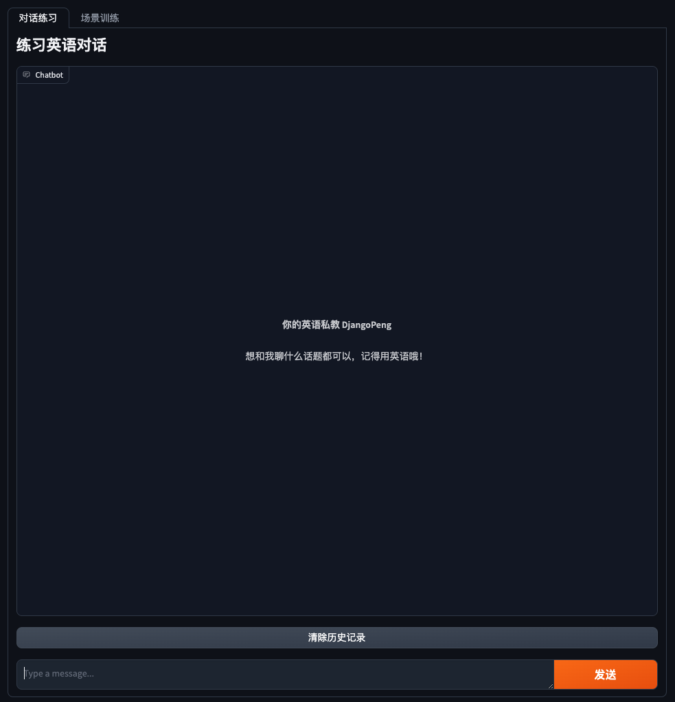
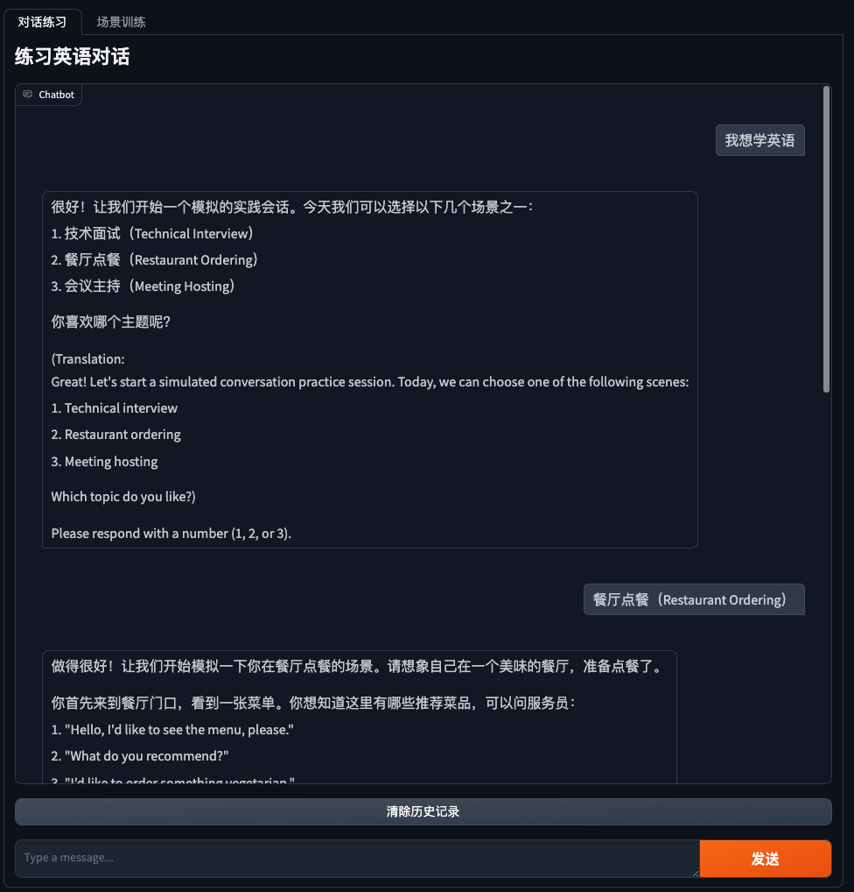
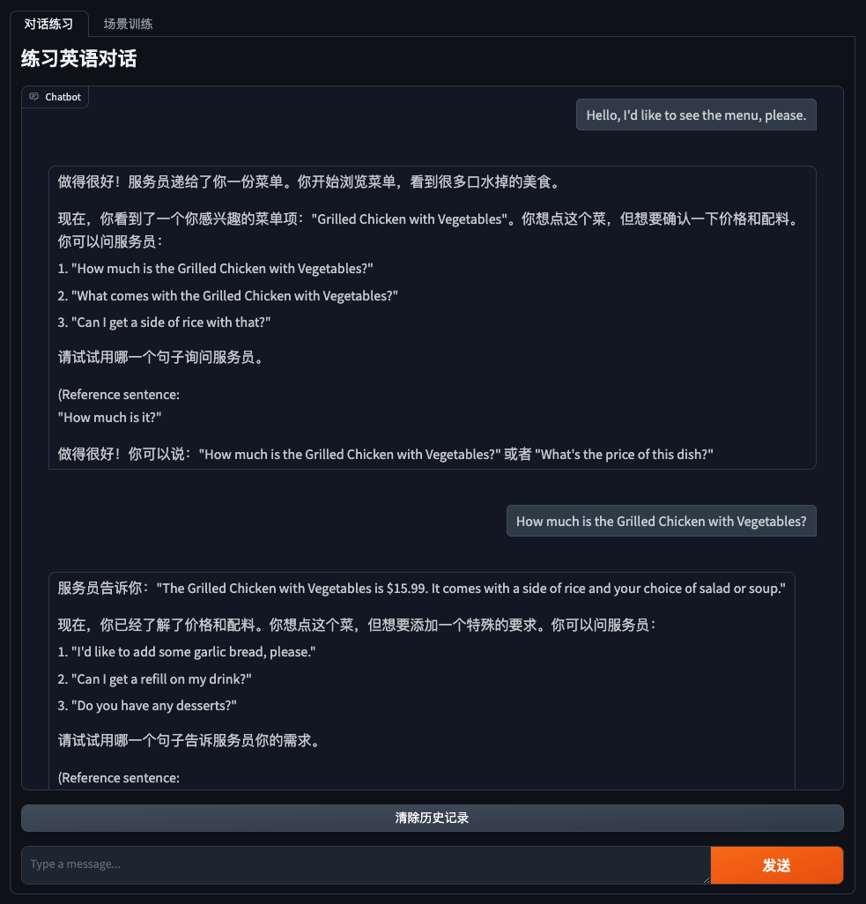

# LanguageMentor

LanguageMentor 是一款基于 LLaMA 3.1 或 GPT-4o-mini 的在线英语私教系统，提供英语对话练习和场景化学习训练。用户可以选择不同的场景，或直接与对话代理人进行自由对话，模拟真实生活中的英语交流场景，提升语言能力。


## 产品设计

- 核心功能：
  - 基础教学：涵盖词汇积累、语法学习、阅读理解和写作技巧等基础内容。
  - 对话式训练：模拟真实场景的对话练习，提升学生的口语表达能力和听力理解能力。
- 用户学习路径：
  - 初学者：注重词汇和基础语法的学习，通过简单对话练习提高自信心。
  - 中级学员：结合复杂语法和高级词汇，进行更深入的阅读和写作训练。
  - 高级学员：重点练习口语和听力，通过模拟真实场景的对话提升实战能力。
- 课程设计：
  - 词汇积累：采用词根词缀法和常用词汇表，帮助学生高效记忆单词。
  - 语法学习：通过系统的语法讲解和练习，夯实学生的语法基础。
  - 阅读理解：提供不同难度的阅读材料，训练学生的阅读速度和理解能力。
  - 写作技巧：指导学生如何进行段落和文章的结构化写作。

## 产品演示

https://github.com/user-attachments/assets/6298a8e4-28fc-4a60-badc-59bff16b315e


## 快速开始
以下是快速开始使用 LanguageMentor 的步骤：

1. **克隆仓库**
   ```bash
   git clone https://github.com/DjangoPeng/LanguageMentor.git
   cd LanguageMentor
   ```

2. **创建 Python 虚拟环境**
   使用 miniconda 或类似 Python 虚拟环境管理工具，创建一个项目专属的环境，取名为`lm`：
   ```bash
   conda create -n lm python=3.10
   ```
   激活虚拟环境
   ```bash
   conda activate lm
   ```

3. **配置开发环境**
   然后运行以下命令安装所需依赖：
   ```bash
   pip install -r requirements.txt
   ```

   根据需要配置你的环境变量，例如 `OpenAI_API_KEY` 等。

4. **运行应用**
   启动应用程序：
   ```bash
   python src/main.py
   ```

5. **开始体验**
   打开浏览器，访问 `http://localhost:7860`，开始跟着 LanguageMentor 一起学习英语！

   运行画面：
   

   对话练习：
   
   


## 贡献
欢迎对本项目做出贡献！你可以通过以下方式参与：
- 提交问题（Issues）和功能请求
- 提交拉取请求（Pull Requests）
- 参与讨论和提供反馈

## 许可证
本项目采用 Apache 2.0 许可证，详情请参阅 [LICENSE](LICENSE) 文件。

## 联系我们

如果你有任何问题或建议，请通过以下方式联系我：
- Email: pjt73651@gmail.com
- GitHub Issues: https://github.com/DjangoPeng/LanguageMentor/issues
